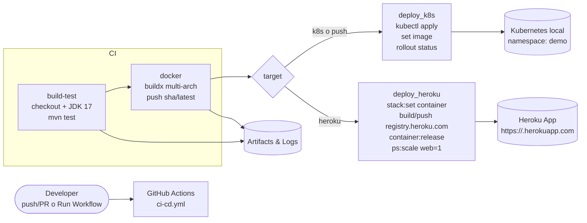

# 🚀 CI/CD para demo-devops-java (K8s local & Heroku)

Este repositorio contiene una app Java (Spring) con un pipeline CI/CD en **GitHub Actions** que:

1) Compila y ejecuta tests (Maven).  
2) Construye imagen Docker **multi-arch** (amd64/arm64) y la publica en Docker Hub.  
3) Despliega según destino:
   - **Kubernetes local** (Minikube o Docker Desktop) usando un **runner self-hosted**.
   - **Heroku** (Container Registry) liberando el contenedor como `web`.

> Puedes elegir el destino en *Run workflow* → `target: k8s | heroku`.

---

## 🧱 Prerrequisitos

- **Docker** (Desktop o Engine).
- **kubectl** y **Minikube** *o* **Docker Desktop Kubernetes**.
- **Heroku CLI**.
- Cuenta en **Docker Hub**.
- Repositorio en **GitHub**.

### Secrets requeridos

| Secret | Descripción |
|---------|-------------|
| `DOCKER_USERNAME` | Usuario de Docker Hub |
| `DOCKER_PASSWORD` | Token o contraseña de Docker Hub |
| `HEROKU_API_KEY` | API Key de Heroku |
| `HEROKU_APP_NAME` | Nombre exacto de la app en Heroku |

---

## 🧩 Estructura

```
.
├─ src/
├─ pom.xml
├─ Dockerfile
├─ k8s/
│  ├─ deployment.yaml
│  ├─ service.yaml
│  ├─ ingress.yaml
│  ├─ configmap.yaml
│  └─ secret.yaml
└─ .github/workflows/ci-cd.yml
```

---

## ▶️ Ejecución del pipeline

### Automática
Por cada `push` o `pull_request` a `main`.

### Manual
Desde **GitHub → Actions → CI-CD (K8s & Heroku)** → *Run workflow*  
Selecciona el destino: `k8s` o `heroku`.

---

## ☸️ Preparar entorno local (Kubernetes)

```bash
kubectl get nodes
kubectl create ns demo
minikube addons enable ingress
```

---

## 🏃 Configurar runner self-hosted

```bash
./config.sh  # Nombre: devops-local, labels: self-hosted,k8s
./run.sh
```

---

## 🔁 Flujo de jobs

- **build-test** → Maven + JaCoCo
- **docker** → buildx multi-arch y push
- **deploy_k8s** → kubectl apply + rollout
- **deploy_heroku** → build/push/release con Heroku CLI

---

## 🌐 Probar despliegues

### Heroku
```bash
curl -i https://<HEROKU_APP_NAME>.herokuapp.com/api/users
heroku logs --tail -a <HEROKU_APP_NAME>
```

### Kubernetes
```bash
kubectl -n demo get pods
kubectl -n demo port-forward svc/demo-service 8080:80
curl -i http://localhost:8080/api/users
```

---

## 🧯 Troubleshooting

- **Rollout atascado**
  ```bash
  kubectl -n demo describe deploy demo-app | sed -n '/Events:/,$p'
  ```
- **Heroku Welcome Page**
  ```bash
  heroku stack:set container -a <app>
  heroku container:release web -a <app>
  ```

---

## 🖼️ Diagrama del pipeline


